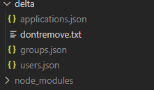
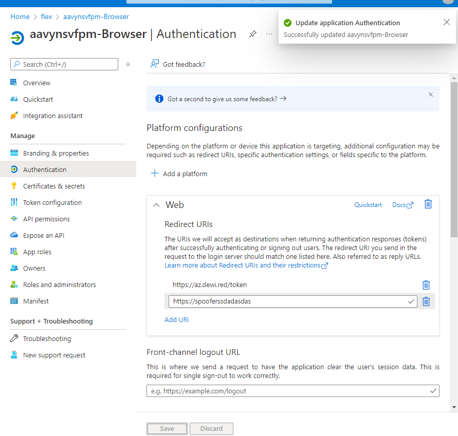

# Microsoft Graph API Delta implementation

https://docs.microsoft.com/en-us/graph/delta-query-overview

## Usage


### prereqs
1. Fire up Azure Cloud Shell (bash)


2. Run the following in console
```

curl -o- https://raw.githubusercontent.com/nvm-sh/nvm/v0.39.0/install.sh | bash

export NVM_DIR="$HOME/.nvm"
[ -s "$NVM_DIR/nvm.sh" ] && \. "$NVM_DIR/nvm.sh"  # This loads nvm
[ -s "$NVM_DIR/bash_completion" ] && \. "$NVM_DIR/bash_completion"  # This loads nvm bash_completion
nvm install 14;
nvm use 14; 

```

### Running the checks
Initial delta will get all the previous data.
```
git clone https://github.com/jsa2/graphDelta;
nvm use 14;
cd graphDelta
npm install

## Clear token cache to get RT's
az account clear
## this will place refresh token in the session
az login

## checks
node getDelta.js --type=users;
node getDelta.js --type=groups;
node getDelta.js --type=applications;

```

### State is monitored in files

   )


- make change in one of the monitored delta entities

  

- to get delta results run the check until you see delta (this might take 1-2 min after change)

```
git clone https://github.com/jsa2/graphDelta;
nvm use 14; 
cd graphDelta
node getDelta.js --type=applications;
```

- Review the changed entity

```json
{
  "delta": "https://graph.microsoft.com/v1.0/applications/....",
  "data": [{
    "appId": "4776ef28-03ba-4187-bfec-f18e7690287d",
    "createdDateTime": "2021-10-05T04:03:18Z",
    "displayName": "aavynsvfpm-Browser",
    "publisherDomain": "thx138.onmicrosoft.com",
    "signInAudience": "AzureADMyOrg",
    "defaultRedirectUri": null,
    "id": "d710c753-600c-419a-8b9f-3fb7236a1ceb",
    "keyCredentials": [],
    "passwordCredentials": [{
      "customKeyIdentifier": null,
      "displayName": null,
      "endDateTime": "2023-10-05T04:03:22.141852Z",
      "hint": "2Cy",
      "keyId": "8220f0ba-fab3-4b60-97e4-d63ded4324af",
      "secretText": null,
      "startDateTime": "2021-10-05T04:03:22.141852Z"
    }],
    "requiredResourceAccess": [{
      "resourceAppId": "00000003-0000-0000-c000-000000000000",
      "resourceAccess": [{
        "id": "e1fe6dd8-ba31-4d61-89e7-88639da4683d",
        "type": "Scope"
      }]
    }, {
      "resourceAppId": "d75418cb-a786-4455-8c39-6a5b536d02b3",
      "resourceAccess": [{
        "id": "d2d0b6df-bbd1-4955-a711-2e4b6ac35b38",
        "type": "Scope"
      }]
    }],
    "web": {
      "homePageUrl": null,
      "logoutUrl": null,
      "redirectUris": ["https://spooferssdadasdas", "https://az.dewi.red/token"],
      "implicitGrantSettings": {
        "enableAccessTokenIssuance": false,
        "enableIdTokenIssuance": false
      }
    },
    "spa": {
      "redirectUris": []
    }
  }]
}
```


### End of doc