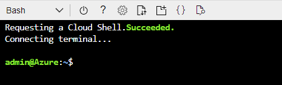

# Microsoft Graph API Delta implementation

https://docs.microsoft.com/en-us/graph/delta-query-overview

## Usage


### prereqs
1. Fire up Azure Cloud Shell (bash)




2. Run the following in console
```
git clone

curl -o- https://raw.githubusercontent.com/nvm-sh/nvm/v0.39.0/install.sh | bash

export NVM_DIR="$HOME/.nvm"
[ -s "$NVM_DIR/nvm.sh" ] && \. "$NVM_DIR/nvm.sh"  # This loads nvm
[ -s "$NVM_DIR/bash_completion" ] && \. "$NVM_DIR/bash_completion"  # This loads nvm bash_completion


```

### Running
Initial delta will get all the previous data.
```
git clone https://github.com/jsa2/graphDelta;
nvm use 14; 
cd deltaMon
node getDelta.js --type=users;
node getDelta.js --type=groups;
node getDelta.js --type=applications;

```


